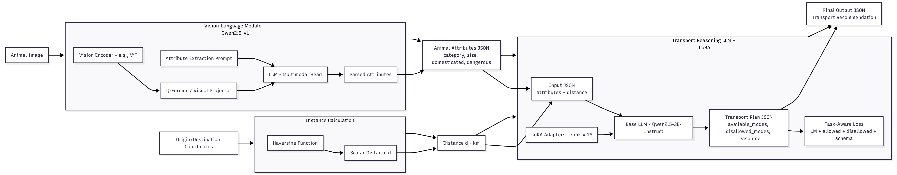

# Animal Transport Reasoning System

This project implements a multimodal research system that determines **allowed transportation modes** and **estimated travel times** for an animal, given:

**Note:** The `animal_transport_full_pipeline.ipynb` Jupyter notebook contains the complete experiment workflow from training to inference. This project follows industry-standard coding practices with modular architecture, comprehensive testing, and production-ready deployment options.

- an **image of the animal**
- **start coordinates** (lat/lon)
- **end coordinates**

The system uses:

- **Qwen/Qwen2.5-VL-3B-Instruct** (Vision-Language Model)
- **Qwen/Qwen2.5-3B-Instruct** fine-tuned using **QLoRA**
- **Synthetic dataset generation**
- **FastAPI** for inference
- **Docker** with **GPU support**
- Fully local inference (no external APIs)

## 🚀 Quick Start

### Prerequisites
- NVIDIA GPU with CUDA support
- Python 3.10+

### Local Development
```bash
# Setup environment
conda create -n animal python=3.10 -y
conda activate animal
pip install -r requirements.txt
pip install torch torchvision torchaudio --index-url https://download.pytorch.org/whl/cu124


# Generate dataset
python scripts/generate_dataset.py

# Train model
python scripts/train.py

# Run API
uvicorn src.animal_transport.api.main:app --host 0.0.0.0 --port 8000
```

---

# 📦 Installation Guide

Local development is recommended. For production deployment, Docker can be used.

## 🔧 Local Development Setup

### Prerequisites
- Python 3.10+
- NVIDIA GPU (We developed with V100 server )with CUDA 12.1+
- Conda (recommended for environment management)

### 1. Create Python Environment
```bash
conda create -n animal python=3.10 -y
conda activate animal
```

### 2. Install Dependencies
```bash
pip install -r requirements.txt
```

### 3. Verify Installation
```bash
python -c "import torch; print('CUDA available:', torch.cuda.is_available())"
```

## 🐳 Docker Deployment

For production deployment, install Docker with NVIDIA Container Toolkit support.

---

# 🚀 Running the Project

## Dataset Generation
Generate synthetic training data:
```bash
python scripts/generate_dataset.py
```

## Model Training
Fine-tune the reasoning model:
```bash
python scripts/train.py
```

## API Server
Start the FastAPI inference server:
```bash
uvicorn src.animal_transport.api.main:app --host 0.0.0.0 --port 8000
```

## Testing

```bash
# Run individual tests
python tests/test_LLM_inference.py
python tests/test_VLM_inference.py
```

## API Usage
Once the server is running, you can open http://localhost:8000/docs for manual testing, or alternatively you can make requests like the example below:

```python
import requests
import base64

# Prepare image
with open("path/to/animal.jpg", "rb") as f:
    img_data = base64.b64encode(f.read()).decode()

# Make request
response = requests.post(
    "http://localhost:8000/infer",
    json={
        "file": img_data,  # base64 encoded image
        "start_lat": 48.85,
        "start_lon": 2.35,
        "end_lat": 51.5074,
        "end_lon": -0.1278
    }
)

print(response.json())
```

---
## Example Output

### VLM Output JSON

```json
{'animal_name': 'tiger', 'animal_category': 'wild', 'size_class': 'large', 'is_domesticated': False, 'dangerous_to_humans': True}
```

### LLM → Transport Plan

```json
{
  "available_modes": [
    "specialized_animal_freight"
  ],
  "disallowed_modes": [
    "car_cabin",
    "car_crate",
    "van_cargo",
    "truck_livestock",
    "bus_cabin",
    "train_cabin",
    "train_cargo",
    "plane_cabin",
    "plane_cargo"
  ],
  "distance_km": 150.0,
  "estimated_travel_time_hours": {
    "bus_cabin": null,
    "car_cabin": null,
    "car_crate": null,
    "plane_cabin": null,
    "plane_cargo": null,
    "specialized_animal_freight": 2.48,
    "train_cabin": null,
    "train_cargo": null
  },
  "reasoning": "Dangerous or wild animals are not permitted in passenger cabins of public transport. Long-distance travel favors air transport or specialized freight due to time and welfare."
}
```

---

# 🧠 System Overview




---

# 🛠️ Development

## Code Structure
The project follows a modular architecture:

- **`src/animal_transport/`**: Main package
  - **`api/`**: FastAPI application and inference logic
  - **`train/`**: Training pipeline components
- **`scripts/`**: Executable scripts for training and data generation
- **`tests/`**: Unit and integration tests
- **`data/`**: Datasets and training data
- **`models/`**: Saved model checkpoints
- **`docker/`**: Container configurations

## Environment Variables
Create a `.env` file in the project root:
```bash
REASONING_MODEL_NAME=Qwen/Qwen2.5-3B-Instruct
VLM_MODEL_NAME=Qwen/Qwen2.5-VL-3B-Instruct
```

---

# 📁 Project Structure

```
animal_transport_project/
├── src/
│   └── animal_transport/
│       ├── __init__.py
│       ├── api/
│       │   ├── __init__.py
│       │   ├── main.py          # FastAPI app
│       │   ├── config.py        # API configuration
│       │   ├── inference_vlm.py # VLM inference
│       │   ├── inference_reasoning.py # LLM reasoning
│       │   ├── schemas.py       # Pydantic models
│       │   ├── prompts.py       # System prompts
│       │   ├── rules.py         # Transport rules
│       │   └── utils_distance.py # Distance calculations
│       └── train/
│           ├── __init__.py
│           ├── config.py        # Training config
│           ├── custom_trainer.py
│           ├── data.py          # Dataset class
│           ├── evaluator.py
│           ├── finetune_llm.py
│           ├── loss.py
│           ├── metrics.py
│           ├── model.py         # Model loading & LoRA
│           ├── pipeline.py
│           ├── train.py         # Training logic
│           ├── utils.py
│           ├── callbacks/
│           ├── configuration/
│           ├── core/
│           ├── data/
│           ├── evaluation/
│           ├── metrics_logging/
│           ├── scripts/
│           └── utilities/
├── scripts/
│   ├── generate_dataset.py      # Dataset generation
│   ├── task_aware_training.py
│   └── train.py                 # Training entry point
├── data/
│   ├── dataset/
│   └── train/
│       └── train.jsonl          # Training dataset
├── models/                      # Saved models
├── evaluation_results/          # Evaluation outputs
├── figures/                     # Plots and visualizations
├── tests/
│   ├── test_LLM_inference.py
│   ├── test_VLM_inference.py
│   ├── test_qwen.py
│   └── *.jpg, *.jpeg, *.avif, *.webp  # Test images
├── docker/
│   ├── Dockerfile.training
│   ├── Dockerfile.api
│   ├── requirements.txt
│   ├── requirements_cpu.txt
│   └── environment.yml
├── docs/
│   └── README.md
├── animal_transport_full_pipeline.ipynb  # Jupyter notebook with full experiment
├── pyproject.toml               # Package configuration
├── requirements.txt             # Dependencies
├── requirements.in
├── .env                         # Environment variables
├── .env.example                 # Example env file
└── .gitignore
```

